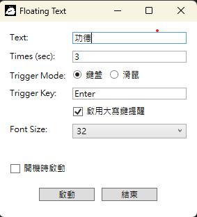
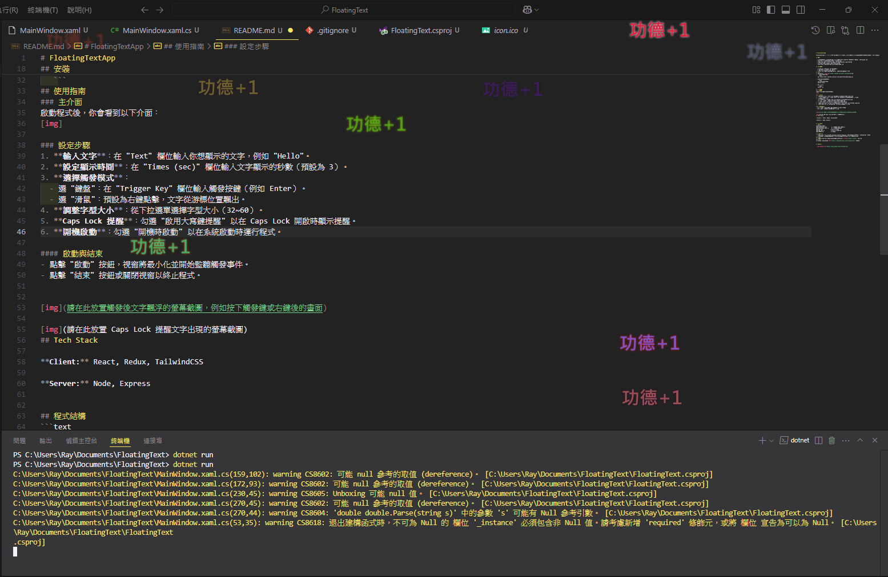
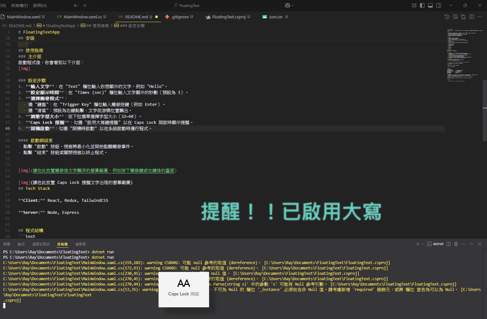

# FloatingTextApp

FloatingTextApp 是一個基於 WPF 的桌面應用程式，允許使用者在螢幕上顯示自訂的飄浮文字。支援鍵盤或滑鼠觸發，並提供 Caps Lock 提醒功能，適合用於提示或趣味應用。

## 功能

- **自訂飄浮文字**：輸入文字並設定顯示時間，觸發後文字會從螢幕隨機位置或滑鼠游標上方飄出。
- **觸發模式**：支援鍵盤按鍵或滑鼠右鍵觸發。
- **Caps Lock 提醒**：當啟用 Caps Lock 時，可選擇顯示提醒文字。
- **字型大小選擇**：提供多種字型大小選項。
- **開機啟動**：可選擇是否在系統啟動時自動運行。

## 系統需求

- **作業系統**：Windows 10 或更高版本
- **.NET 版本**：.NET 6 或 .NET 8
- **權限**：部分功能（如全域鍵盤/滑鼠鉤子）可能需管理員權限

## 安裝
1. 確保已安裝 [.NET SDK](https://dotnet.microsoft.com/download)。
2. 複製此專案到本地：
   ```bash
   git clone https://github.com/khRay13/FloatingText.git
   ```
3. 進入專案目錄並編譯：
   ```bash
   cd FloatingText
   dotnet build
   ```
4. 運行程式：
   ```bash
   dotnet run
   ```

## 使用指南
### 主介面
啟動程式後，你會看到以下介面：


### 各項設定與調整
1. **輸入文字**：在 "Text" 欄位輸入你想顯示的文字，例如 "功德"。
2. **設定顯示時間**：在 "Times (sec)" 欄位輸入文字顯示的秒數（預設為 3）。
3. **選擇觸發模式**：
  - 選 "鍵盤"：在 "Trigger Key" 欄位輸入觸發按鍵（例如 Enter）。
  - 選 "滑鼠"：預設為右鍵點擊，文字從游標位置飄出。
4. **調整字型大小**：從下拉選單選擇字型大小（32~60）。
5. **Caps Lock 提醒**：勾選 "啟用大寫鍵提醒" 以在 Caps Lock 開啟時顯示提醒。
6. **開機啟動**：勾選 "開機時啟動" 以在系統啟動時運行程式。

#### 啟動與結束
- 點擊 "啟動" 按鈕，視窗將最小化並開始監聽觸發事件。
- 點擊 "結束" 按鈕或關閉視窗以終止程式。





## 程式結構
```text
FloatingTextApp/
├── MainWindow.xaml        # 主視窗的 XAML 介面定義
├── MainWindow.xaml.cs     # 主邏輯與事件處理
├── App.xaml              # 應用程式入口
├── App.xaml.cs           # 應用程式啟動邏輯
└── README.md             # 本文件
```
### 已知問題
- **Caps Lock 檢測**：在某些系統上，`Console.CapsLock` 可能不準確，建議改用 `GetKeyState` API。
- **權限要求**：全域鉤子需管理員權限，若未提升權限，可能顯示設置失敗訊息。
- **Trigger Key**：使用 `BACKSPACE(退回鍵)` 和 `SPACE(空白鍵)` 會設定失敗

### 貢獻
歡迎提交問題或 Pull Request！若有功能建議，請在 [Issues](https://github.com/khRay13/FloatingText/issues) 中提出。

### 授權
本專案採用 。詳情請見 [BSD-3-Clause license](https://github.com/khRay13/FloatingText/blob/main/LICENSE) 文件。

## Authors
- [@khRay13](https://github.com/khRay13)
